#### Работу выполнили:
> 👩🏻‍💻  [@Ksuvot](https://github.com/Ksuvot) - *Ксения Вотинова*  
> 👨🏻‍💻 [@VarginDimitry](https://github.com/VarginDimitry) - *Дмитрий Варгин*

---

### Уровень 1
#### 1
```SQL
-- Создаём базу данных
CREATE DATABASE "BOOKSTORE"
    WITH 
    OWNER = postgres
    ENCODING = 'UTF8'
    CONNECTION LIMIT = -1;

-- Таблица покупателей
CREATE TABLE customer (
	id serial NOT NULL,
	name VARCHAR(50) NOT NULL,
	area VARCHAR(100),
	discount float DEFAULT 0.0,
	PRIMARY KEY (id)
);

-- Таблица магазинов
CREATE TABLE store (
	id serial NOT NULL,
	name VARCHAR(100) NOT NULL,
	area VARCHAR(100) NOT NULL,
	commission float DEFAULT 0.0,
	PRIMARY KEY (id)
);

-- Таблица книг
CREATE TABLE book (
	id serial NOT NULL,
	name VARCHAR(100) NOT NULL,
	price float NOT NULL,
	bstorage VARCHAR(50),
	quantity int DEFAULT 0,
	PRIMARY KEY (id)
);

-- Таблица покупок
CREATE TABLE purchase (
	id serial NOT NULL,
	pdate date DEFAULT NOW(),
	store_id int NOT NULL,
	customer_id int NOT NULL,
	book_id int NOT NULL,
	quantity int DEFAULT 0,
	PRIMARY KEY (id),
	psum float NOT NULL,
	FOREIGN KEY(store_id) REFERENCES store(id) ON UPDATE CASCADE,
	FOREIGN KEY(customer_id) REFERENCES customer(id) ON UPDATE CASCADE,
	FOREIGN KEY(book_id) REFERENCES book(id) ON UPDATE CASCADE
);
```

---

#### 2
```SQL
-- Заполняем таблицу Покупатель
INSERT INTO customer VALUES
	(1, 'Сидоров', 'Нижегородский', 10),
	(2, 'Потапов', 'Советский', 20),
	(3, 'Попов', 'Ленинский', 10),
	(4, 'Романова', 'Нижегородский', 10),
	(5, 'Миронов', 'Автозаводский', 15),
	(6, 'Попов', 'Советский', 0);

-- Заполняем таблицу Магазин
INSERT INTO store VALUES
	(1, 'Знание', 'Автозаводский', 7),
	(2, 'Наука', 'Нижегородский', 8),
	(3, 'Книжный мир', 'Приокский', 6),
	(4, 'Книги', 'Сормовский', 9),
	(5, 'Книги', 'Советский', 7);

-- Заполняем таблицу Книги
INSERT INTO book VALUES
	(1, 'Windows для чайников', 15000, 'Сормовский', 400),
	(2, 'Excel 5.0', 23000, 'Сормовский', 360),
	(3, 'Работа с Visual FoxPro', 32000, 'Нижегородский', 300),
	(4, 'Программирование в среде Delphi', 20000, 'Нижегородский', 100),
	(5, 'SQL', 47000, 'Автозаводский', 89),
	(6, 'Word 6.0 для Windows', 16000, 'Сормовский', 200),
	(7, 'Твой первый выход в Internet', 15000, 'Советский', 140);

-- Заполняем таблицу Покупки
INSERT INTO purchase VALUES
	(10011, '2020-01-01', 1, 6, 3, 2, 64000),
	(10012, '2020-01-01', 1, 6, 2, 2, 46000),
	(10013, '2020-01-01', 5, 5, 4, 4, 80000),
	(10014, '2020-02-01', 1, 3, 3, 3, 96000),
	(10015, '2020-02-01', 4, 6, 2, 1, 23000),
	(10016, '2020-03-01', 1, 4, 7, 2, 30000),
	(10017, '2020-03-01', 5, 6, 6, 3, 48000),
	(10018, '2020-04-01', 1, 1, 3, 3, 96000),
	(10019, '2020-04-01', 3, 3, 7, 2, 30000),
	(10020, '2020-04-01', 5, 2, 2, 5, 115000),
	(10021, '2020-04-01', 5, 2, 1, 3, 45000),
	(10022, '2020-05-01', 2, 3, 7, 2, 30000),
	(10023, '2020-05-01', 2, 4, 3, 1, 32000),
	(10024, '2020-05-01', 4, 3, 5, 1, 47000),
	(10025, '2020-05-01', 4, 6, 3, 4, 60000),
	(10026, '2020-05-01', 5, 1, 5, 3, 80000),
	(10027, '2020-06-01', 3, 2, 6, 2, 32000);
```

---

#### 3
##### a) `SELECT * FROM purchase;`

##### b) `SELECT * FROM book;`

##### c) `SELECT * FROM customer;`

##### d)`SELECT * FROM store;`


---

#### 4

---

#### 5
##### a)
```SQL
SELECT name, discount
FROM customer WHERE
	area LIKE 'Нижегородский';
```

##### b)
```SQL
SELECT DISTINCT name
FROM store WHERE
	area LIKE 'Сормовский'
	OR area LIKE 'Советский';
```

##### c)
```SQL
SELECT name, price
FROM book WHERE
	name LIKE '%Windows%'
 	OR price > 20000
ORDER BY price DESC;
```


---

#### 6

---

#### 7
##### a)
```SQL
SELECT p.id, name, pdate
FROM purchase p, customer c
WHERE
	p.customer_id = c.id
	and p.psum >= 60000;
```
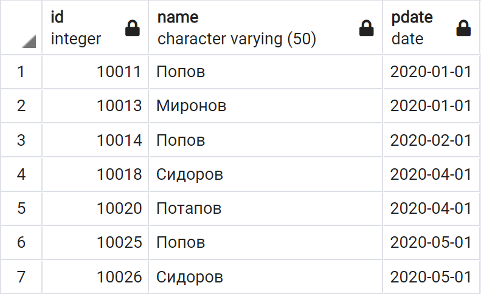
##### b)
```SQL
SELECT c.name, c.area, p.pdate
FROM purchase p, customer c, store s
WHERE
	p.customer_id = c.id
	AND pdate >= '2020-03-01'
	AND s.id = p.store_id
	AND s.area = c.area
ORDER BY c.name ASC
```
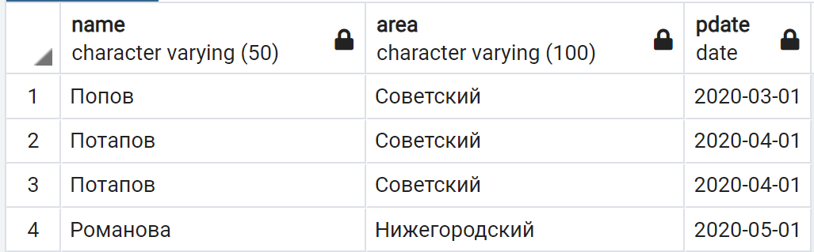
##### c)
```SQL
SELECT s.name, s.area, c.discount
FROM purchase p, customer c, store s
WHERE
	c.discount BETWEEN 10 AND 15
	AND p.customer_id = c.id
	AND s.id = p.store_id
	AND s.area != 'Автозаводский'
GROUP BY s.name, s.area, c.discount;
```

##### d)
```SQL
SELECT b.name, b.bstorage, b.quantity, b.price
FROM book b, purchase p, store s
WHERE
	b.id = p.book_id
	AND s.id = p.store_id
	AND b.quantity > 10
	AND s.area = b.bstorage
ORDER BY b.name ASC;
```
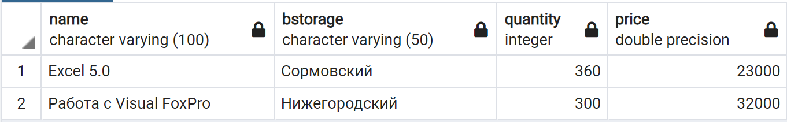

---

#### 8

---

#### 9
```SQL
ALTER TABLE purchase
ADD COLUMN commission float DEFAULT 0.0;

UPDATE purchase
SET commission = s.commission FROM store s
WHERE store_id = s.id;
```
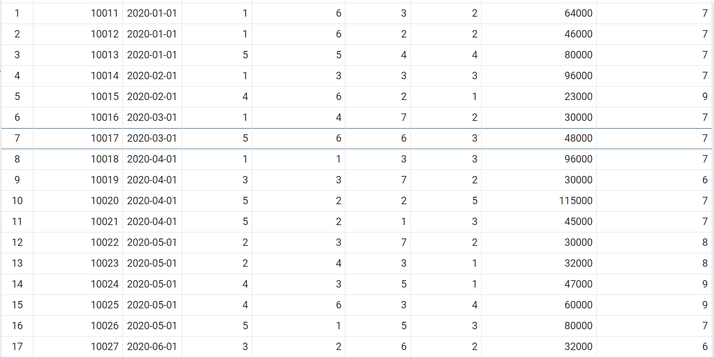

---

#### 10

---

#### 11
##### a)
```SQL
SELECT name
FROM customer
WHERE
	id IN (
		SELECT customer_id
		FROM purchase
		WHERE
			psum >= ALL (
				SELECT psum FROM purchase
				WHERE psum >= 50000
			)
	);
```
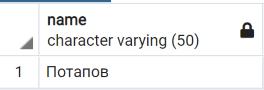
##### b)
```SQL
SELECT name
FROM customer
WHERE
	id IN (
		SELECT customer_id
		FROM purchase
		WHERE
			quantity >= ALL (
				SELECT quantity FROM purchase
			)
	);
```
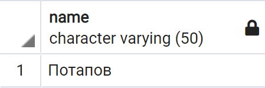
##### c)
```SQL
SELECT c.name, c.area, p.pdate
FROM purchase p, customer c, store s
WHERE
	p.customer_id = c.id
	AND s.id = p.store_id
	AND p.customer_id = ANY(SELECT id FROM customer WHERE area = s.area)
	AND p.pdate = ANY(SELECT pdate FROM purchase WHERE pdate >= '2020-03-01')
ORDER BY c.name ASC;
```

##### d)
```SQL
SELECT c.name
FROM purchase p, customer c, store s
WHERE
	p.customer_id = c.id
	AND s.id = p.store_id
	AND p.customer_id != ALL(SELECT id FROM customer WHERE area = s.area)
	AND p.psum <= ALL(SELECT psum FROM purchase);
```


---

#### 12

---

#### 13
##### a)
```SQL
SELECT DISTINCT c.name
FROM purchase p, customer c
WHERE EXISTS (
	SELECT * FROM purchase
	WHERE p.customer_id NOT IN (
		SELECT p2.customer_id
		FROM purchase p2
		WHERE p2.store_id != 1 AND store_id != 2
	)
	AND c.id = p.customer_id
);
```
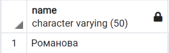
##### b)
```SQL
SELECT DISTINCT c1.name
FROM purchase p1, customer c1
WHERE NOT EXISTS (
	SELECT p2.customer_id
	FROM purchase p2
	WHERE p1.customer_id NOT IN (
		SELECT p3.customer_id
		FROM purchase p3, customer c2, store s
		WHERE
			p3.customer_id = c2.id
			AND p3.store_id = s.id
			AND c2.area = s.area
			AND p3.pdate < '2020-12-01'
	)
) AND p1.customer_id = c1.id;
```
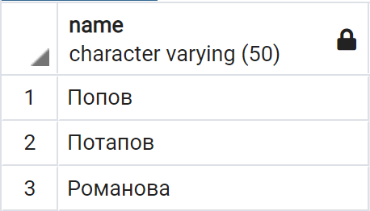
##### c)
```SQL
SELECT DISTINCT c1.name
FROM purchase p1, customer c1
WHERE EXISTS (
	SELECT *
	FROM purchase
	WHERE p1.customer_id NOT IN (
		SELECT p3.customer_id
		FROM purchase p3
		WHERE
			p3.commission = ALL(SELECT MAX(commission) FROM store)
	)
) AND p1.customer_id = c1.id;
```
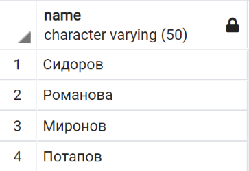
##### d)
```SQL
SELECT name
FROM customer c
WHERE NOT EXISTS (
	SELECT customer_id FROM purchase
    WHERE c.id = purchase.customer_id
		AND purchase.psum > 25000
		AND purchase.pdate >= '2020-05-01'
      	AND purchase.store_id IN (
			SELECT store.id FROM store
        	WHERE commission = ( SELECT MAX(commission) FROM store )
		)
);
```
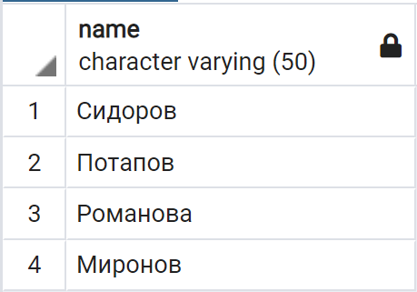

---

#### 14

---

#### 15
##### a)
```SQL
SELECT s.name, SUM(p.psum)
FROM store s, purchase p
WHERE s.id = p.store_id
GROUP BY s.name, s;
```
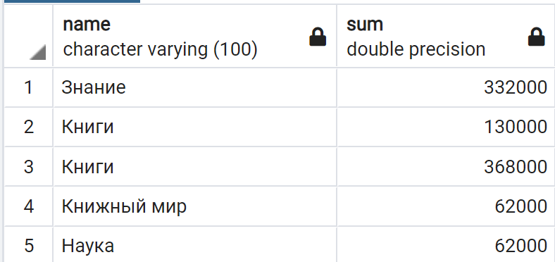
##### b)
```SQL
SELECT s.area, SUM(p.psum)
FROM store s, purchase p
WHERE s.id = p.store_id
GROUP BY s.area, s;
```
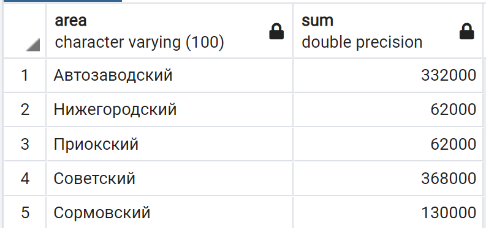
##### c)
```SQL
SELECT c.name, SUM(p.psum)
FROM customer c, purchase p
WHERE c.id = p.store_id
GROUP BY c.name;
```
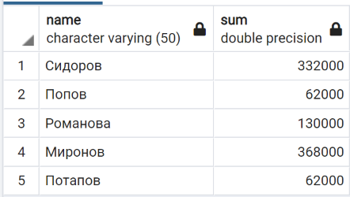
##### d)
```SQL
SELECT p.pdate, SUM(p.quantity)
FROM customer c, purchase p
WHERE
	c.id = p.customer_id
	AND	c.area != 'Советский'
GROUP BY p.pdate
ORDER BY p.pdate;
```
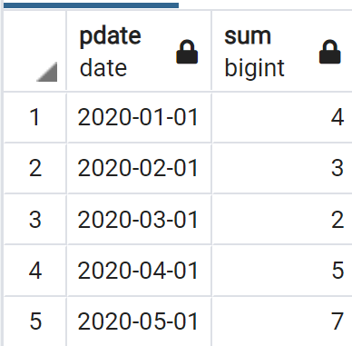