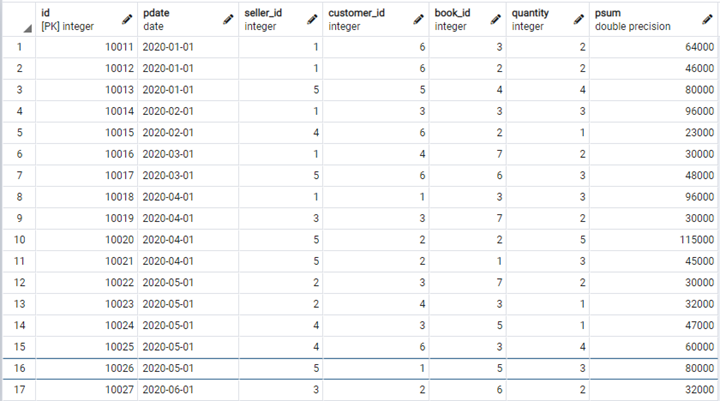
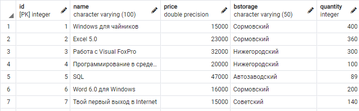
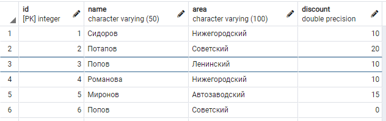
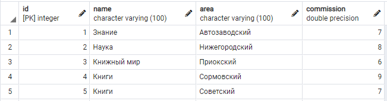
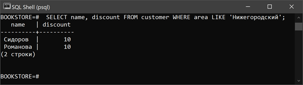
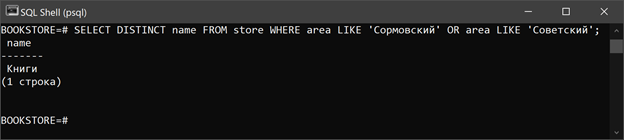
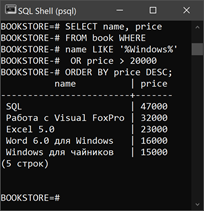

### Уровень 1
#### 1
```SQL
-- Создаём базу данных
CREATE DATABASE "BOOKSTORE"
    WITH 
    OWNER = postgres
    ENCODING = 'UTF8'
    CONNECTION LIMIT = -1;

-- Таблица покупателей
CREATE TABLE customer (
	id serial NOT NULL,
	name VARCHAR(50) NOT NULL,
	area VARCHAR(100),
	discount float DEFAULT 0.0,
	PRIMARY KEY (id)
);

-- Таблица магазинов
CREATE TABLE store (
	id serial NOT NULL,
	name VARCHAR(100) NOT NULL,
	area VARCHAR(100) NOT NULL,
	commission float DEFAULT 0.0,
	PRIMARY KEY (id)
);

-- Таблица книг
CREATE TABLE book (
	id serial NOT NULL,
	name VARCHAR(100) NOT NULL,
	price float NOT NULL,
	bstorage VARCHAR(50),
	quantity int DEFAULT 0,
	PRIMARY KEY (id)
);

-- Таблица покупок
CREATE TABLE purchase (
	id serial NOT NULL,
	pdate date DEFAULT NOW(),
	seller_id int NOT NULL,
	customer_id int NOT NULL,
	book_id int NOT NULL,
	quantity int DEFAULT 0,
	PRIMARY KEY (id),
	psum float NOT NULL,
	FOREIGN KEY(seller_id) REFERENCES customer(id) ON UPDATE CASCADE,
	FOREIGN KEY(customer_id) REFERENCES customer(id) ON UPDATE CASCADE,
	FOREIGN KEY(book_id) REFERENCES book(id) ON UPDATE CASCADE
);
```

#### 2
```SQL
-- Заполняем таблицу Покупатель
INSERT INTO customer VALUES
	(1, 'Сидоров', 'Нижегородский', 10),
	(2, 'Потапов', 'Советский', 20),
	(3, 'Попов', 'Ленинский', 10),
	(4, 'Романова', 'Нижегородский', 10),
	(5, 'Миронов', 'Автозаводский', 15),
	(6, 'Попов', 'Советский', 0);

-- Заполняем таблицу Магазин
INSERT INTO store VALUES
	(1, 'Знание', 'Автозаводский', 7),
	(2, 'Наука', 'Нижегородский', 8),
	(3, 'Книжный мир', 'Приокский', 6),
	(4, 'Книги', 'Сормовский', 9),
	(5, 'Книги', 'Советский', 7);

-- Заполняем таблицу Книги
INSERT INTO book VALUES
	(1, 'Windows для чайников', 15000, 'Сормовский', 400),
	(2, 'Excel 5.0', 23000, 'Сормовский', 360),
	(3, 'Работа с Visual FoxPro', 32000, 'Нижегородский', 300),
	(4, 'Программирование в среде Delphi', 20000, 'Нижегородский', 100),
	(5, 'SQL', 47000, 'Автозаводский', 89),
	(6, 'Word 6.0 для Windows', 16000, 'Сормовский', 200),
	(7, 'Твой первый выход в Internet', 15000, 'Советский', 140);

-- Заполняем таблицу Покупки
INSERT INTO purchase VALUES
	(10011, '2020-01-01', 1, 6, 3, 2, 64000),
	(10012, '2020-01-01', 1, 6, 2, 2, 46000),
	(10013, '2020-01-01', 5, 5, 4, 4, 80000),
	(10014, '2020-02-01', 1, 3, 3, 3, 96000),
	(10015, '2020-02-01', 4, 6, 2, 1, 23000),
	(10016, '2020-03-01', 1, 4, 7, 2, 30000),
	(10017, '2020-03-01', 5, 6, 6, 3, 48000),
	(10018, '2020-04-01', 1, 1, 3, 3, 96000),
	(10019, '2020-04-01', 3, 3, 7, 2, 30000),
	(10020, '2020-04-01', 5, 2, 2, 5, 115000),
	(10021, '2020-04-01', 5, 2, 1, 3, 45000),
	(10022, '2020-05-01', 2, 3, 7, 2, 30000),
	(10023, '2020-05-01', 2, 4, 3, 1, 32000),
	(10024, '2020-05-01', 4, 3, 5, 1, 47000),
	(10025, '2020-05-01', 4, 6, 3, 4, 60000),
	(10026, '2020-05-01', 5, 1, 5, 3, 80000),
	(10027, '2020-06-01', 3, 2, 6, 2, 32000);
```

#### 3
##### a) `SELECT * FROM purchase;`

##### b) `SELECT * FROM book;`

##### c) `SELECT * FROM customer;`

##### d)`SELECT * FROM store;`


#### 4


#### 5
##### a)
```SQL
SELECT name, discount
FROM customer WHERE
	area LIKE 'Нижегородский';
```

##### b)
```SQL
SELECT DISTINCT name
FROM store WHERE
	area LIKE 'Сормовский'
	OR area LIKE 'Советский';
```

##### c)
```SQL
SELECT name, price
FROM book WHERE
	name LIKE '%Windows%'
 	OR price > 20000
ORDER BY price DESC;
```


#### 6

#### 7

#### 8

#### 9

#### 10

#### 11

#### 12

#### 13

#### 14

#### 15